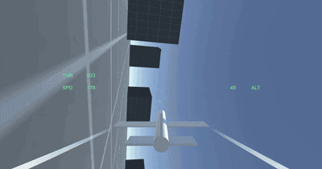
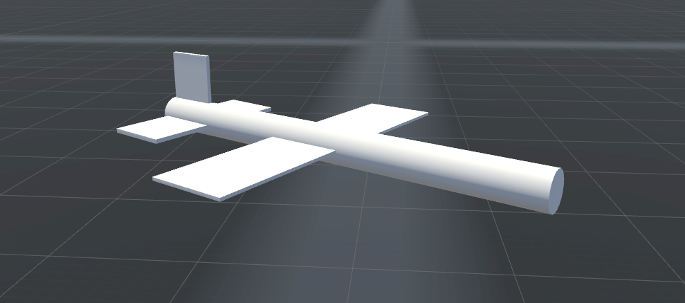
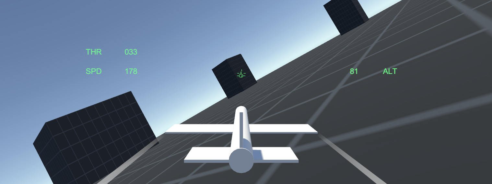

# Arcade Jet Flight Example

This project is an example of a simple arcade style flight action game airplane. It's controlled entirely through Rigidbody physics, so you get all perks (and annoyances) of physics in addition to a very straightforward and easy to handle plane. The code is heavily commented.

Built in **Unity 2017.3**.

## Download

You can either clone the repository or [download the asset package](./ArcadeJetFlightExample.unitypackage) located in the root.

## Controls

The default controls in the example project are built around an Xbox One controller and a typical "Ace Combat" control scheme. If you have another gamepad, you may have to adjust the inputs.

Note that if you import the Asset Package, you will have to set up some additional controls. The first is a **Yaw** axis. It is as single axis that controls the rudder of the plane. The second and third are **ThrottleUp** and **ThrottleDown** respectively. These are simple buttons, and are used to control the speed. There is no axis to directly control the throttle.

- L.Thumbstick - Pitch and Yaw
- L/R Triggers - Yaw
- L Bumper - Slow down
- R Bumper - Speed up

## The Jet

The jet consists of two components: **StickInput** and **JetMovement**. Both are very simple and scripts.

### Jet Movement

The first thing you must do is assign an input. Jet movement requires values from a **StickInput** component in order to figure out how to apply the forces it has. Also worth noting is that the default values assume a Rigidbody with a mass of 100 and colliders in a rough airplane shape.

#### Flying smoothly

In order to fly correct, the plane requires a high drag: 5 in the example. Without such a high drag, the plane would slip significantly and take time to adjust velocity vector. Planes don't generally slip around like that, and for a fast action oriented flight game you want tight and predictable controls. However, with such a high drag, the forces applied to it must be smoothly ramped up and down. If not, the same forces that allow the plane to change directions so quickly, will also make the plane accelerate and decelerate almost instantly in response to throttle changes.

To get around this, the jet has a target throttle and a true throttle. The target throttle is simply the user's input. The true throttle is a "fake" throttle that moves toward the target throttle at a rate determined by the acceleration value of the jet. The higher the acceleration, the faster the plane will respond to changes in speed.

#### Banking

A common property of planes is that when they are banked (nose pointed at the horizon, but wings not level), they tend to turn slightly in the direction they are banked. This is a natural consequence of aerodynamic forces involved, but because those are not simulated here, we need to fake this bank force.

To get the plane to do something *like* it, a yaw force is applied in the direction of the bank. For example, if a plane is banked to the right, it will yaw to the right. This will also pull the nose downwards, requiring the pilot to give a slight pitch up in order to maintain level flight in a turn, a behavior that is actually fairly close to reality.

The way this gets done is through some not so obvious Transform vector usage. Using the Y value of the right, we can tell how "high" the right wing is. A value of -1/1 means the plane is flying sideways. It also automatically takes care of cases where the plane is flying straight up or down because in those situations your right must have negligible Y value. That number is turned into the "bank factor" so that at 90 degrees bank to the right, it will apply the bank torque at full power to the plane.
